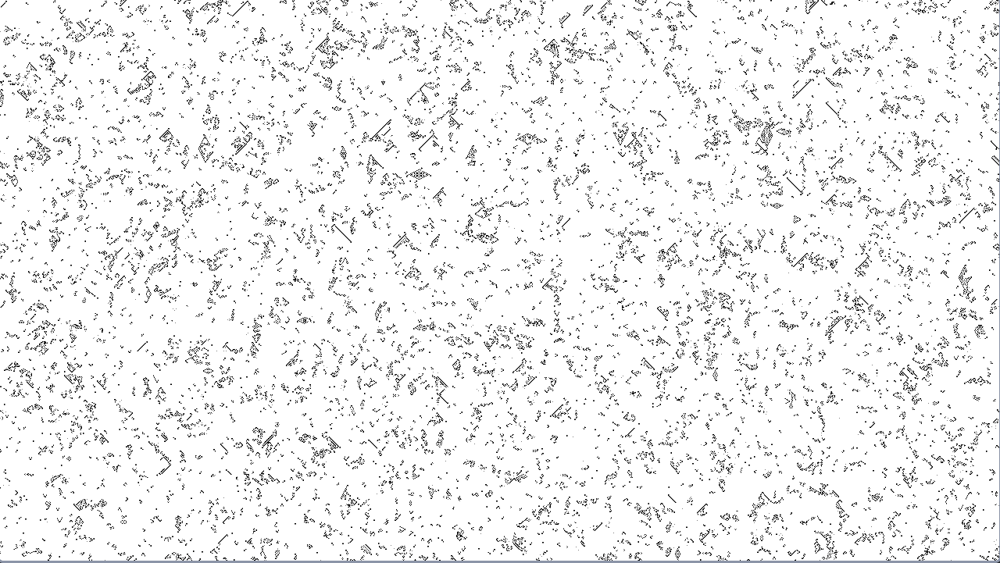
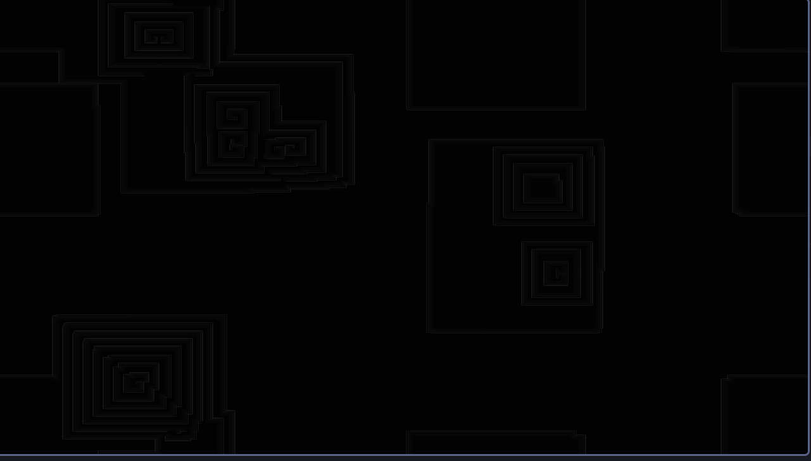

# cellular-automata

A demonstration of various cellular automata

## Rules for Brian's Brain cellular automata

- A cell may be in three states: on, dying, off
- Each cell has eight neighbors(Moore)
- A cell turns on if it was off but has _exactly_ 2 neighbors that are on
- All cells that are on go into the dying state
- All cells in the dying state turn off

## Rules for Belousov Zhabotinsky's cellular automata

- A cell exists in n states. (eg n=100) 
- A cell that is completely infected (at n) automatically becomes healthy again
- If a cell is between 0 and n it becomes the average of the states of its neighbors plus g
- if a cell is helthy it becomes the average of the number of infected neighbors

## Screenshots

